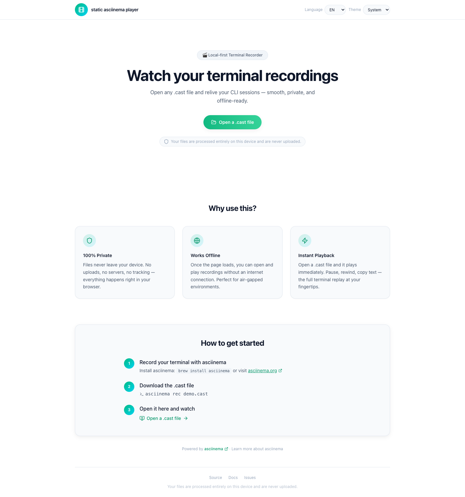

# asciinema online player

A modern, privacy-first web player for [asciinema](https://asciinema.org) recordings. Open `.cast` files directly in your browser — nothing leaves your device.



## Features

- **100% Private** — files are processed locally, never uploaded
- **Works Offline** — fully functional without internet after initial page load
- **Instant Playback** — open a `.cast` file and it plays immediately
- **Dark & Light** — system, light, and dark theme modes with persistent preference
- **English / 中文** — full bilingual UI, switch without reloading
- **Keyboard Accessible** — WCAG 2.2 AA compliant, screen-reader friendly
- **Atomic Replace** — swap recordings without losing the current one

## How it works

1. **Record** your terminal with [asciinema](https://asciinema.org/docs/installation):
   ```bash
   brew install asciinema
   asciinema rec demo.cast
   ```
2. **Open** [the player](https://asciinema-online-player.alswl.com/play) and select your `.cast` file
3. **Watch** — pause, rewind, copy text, switch themes

## Development

```bash
npm install
npm run dev        # Turbopack dev server
npm run lint       # ESLint
npm run typecheck  # TypeScript
npm run test       # Vitest
npm run e2e        # Playwright
npm run build      # Static export → out/
```

## Tech Stack

| Layer     | Choice                                 |
| --------- | -------------------------------------- |
| Framework | Next.js 16 (App Router, static export) |
| UI        | React 19, Tailwind CSS 4               |
| Icons     | lucide-react                           |
| Player    | asciinema-player 3.x                   |
| Tests     | Vitest + Testing Library, Playwright   |
| CI        | GitHub Actions → Cloudflare Pages      |

## License

[GPL-3.0](LICENSE)
